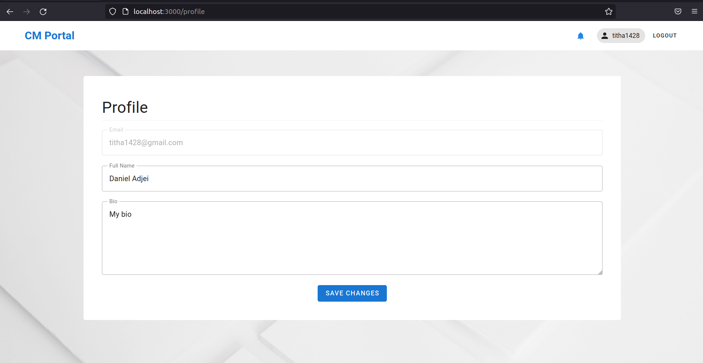

# Credentials Manager

This is a client-side application which manages the creation, storage, retrieval, and deletion of user specific files and records.


## Setup

Make sure to install the dependencies:

```bash
# yarn
yarn install

# npm
npm install

# pnpm
pnpm install
```

## Essentials

1. Create a **Supabase** account.
2. Create a .env file with the following variables

```.env
SUPABASE_URL=[Your Supabase api url]
SUPABASE_KEY=[Your Supabase Anon key]
SUPABASE_BUCKET=[Your supabase storage bucket]

DIRECT_URL="postgresql://postgres:[Your Supabase db password]@db.[Your Supabase Id].supabase.co:5432/postgres"
DATABASE_URL="postgres://postgres:[Your Supabase db password]@db.[Your Supabase ID].supabase.co:6543/postgres?pgbouncer=true"

ACCEPTED_FILE_TYPES = ".csv, .txt, .xlsx, .docs, .doc, .odt, .pdf, .jpg, .jpeg, .png, .mp3"
```

3. Run the following command to setup the Supabase database
```bash
npx prisma db push
```


## Development Server

Start the development server on `http://localhost:3000`

```bash
npm run dev
```

## Production

Build the application for production:

```bash
npm run build
```

Locally preview production build:

```bash
npm run preview
```

## Screenshots
### Signup Screen


### Login Screen


### Dashbord Screen


### Profile Screen


### Access Request Screen


### File Preview Screen
